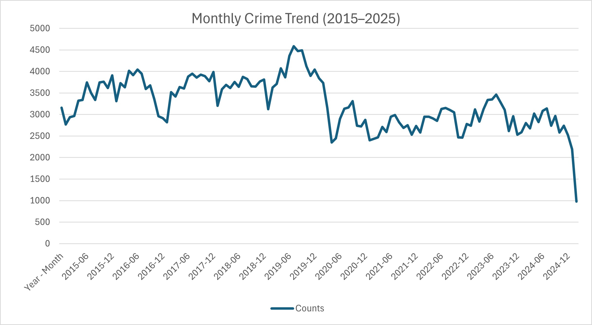
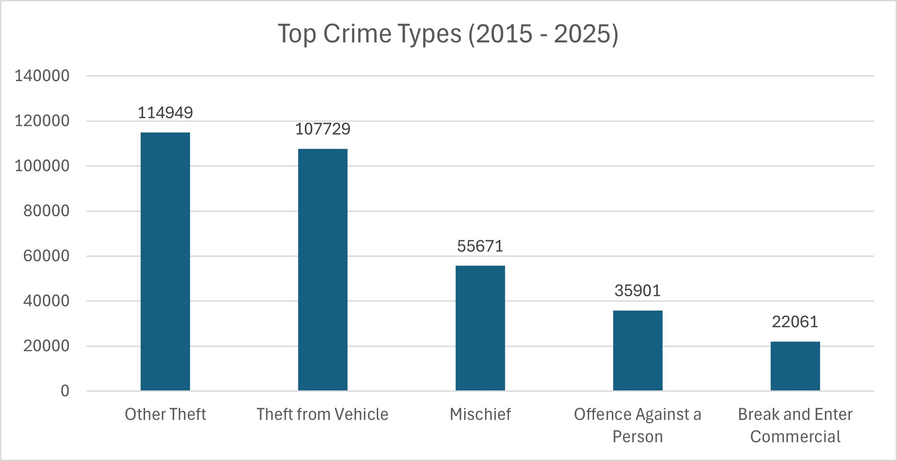
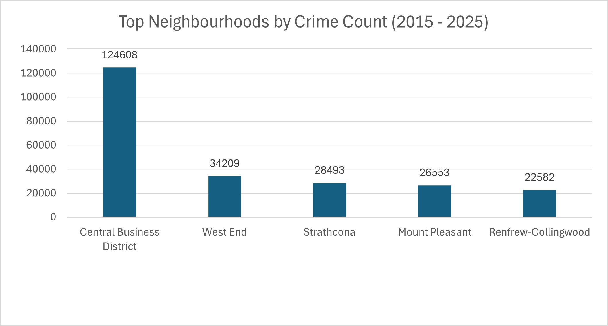
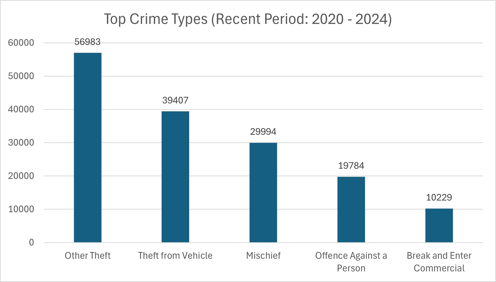
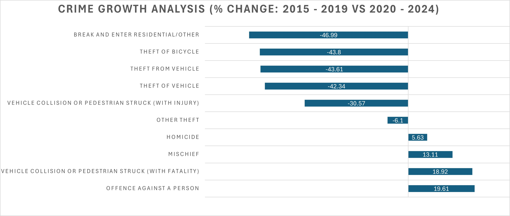

# Vancouver Crime Data Analysis (2015 - 2025)
An end-to-end SQL project analyzing 10 years of crime data to uncover trends, high-risk areas, and changes in crime patterns over time.

---

## Overview
This project analyzes 10 years of Vancouver crime data to understand trends, identify high-crime neighbourhoods, and examine how crime patterns have changed over time.

The analysis was performed using SQL (PostgreSQL) and visualized using Excel.

---

## Objectives
- Analyze monthly crime trends over time
- Identify the most common crime types
- Find neighbourhoods with the highest crime rates
- Compare crime growth between two time periods

---

## Tools Used
- PostgreSQL (SQL)
- Excel (Data Visualization)

---

## Data Source
The dataset used in this project was obtained from the Vancouver Police Department (VPD) Open Data Portal:

https://geodash.vpd.ca/opendata

The data is publicly available and was downloaded as multiple CSV files. These files were merged into a single dataset covering crime incidents from 2015 to March 2025.

---

## Purpose of Analysis
The main aim of this project is to better understand crime patterns in Vancouver by analyzing historical data.

By identifying the most common crime types, high-crime neighbourhoods, and how crime trends change over time, this analysis provides insights that can help individuals become more 
aware and cautious in the city.

---

## Data Preparation
- Created a structured 'crime_data' table
- Combined year, month, day, hour, and minute into a timestamp
- Renamed coordinate columns to latitude and longitude
- Checked for duplicates and handled missing values

---

## Analysis Performed

### 1. Monthly Crime Trend (2015–2025)

- Crime levels fluctuate over time
- A noticeable peak occurs around 2019
- A drop in 2025 is due to incomplete data (only up to March)

---

### 2. Top Crime Types (2015–2025)

- Theft-related crimes dominate across the dataset
- "Other Theft" and "Theft from Vehicle" are the most frequent

---

### 3. Top Neighbourhoods by Crime Count

- The Central Business District has significantly higher crime counts
- Crime is concentrated in key urban areas

---

### 4. Top Crime Types (Recent Period: 2020–2024)

- Theft-related crimes continue to dominate in recent years  
- Despite some decline in growth, these categories still contribute the highest number of incidents
- When compared with the overall trend (2015 - 2025), theft-related crimes remain dominant  
- However, growth analysis shows that some property crimes have declined while certain personal crimes have increased  

---

### 5. Crime Growth Analysis (% Change: 2015 - 2019 vs 2020 - 2024)

- Crimes related to personal safety have increased
- Property-related crimes (vehicle theft, bicycle theft) have decreased
- This indicates a shift in crime patterns over time

---

## Key Insights
- Theft-related crimes remain the most common across the dataset
- Crime is highly concentrated in urban areas such as the Central Business District
- There is a visible shift from property-related crimes to personal safety-related crimes
- Using two equal time periods (2015 - 2019 vs 2020 - 2024) ensures a fair and consistent comparison

---

## SQL Workflow
- `01_table_creation.sql` → Table setup
- `02_data_processing.sql` → Data cleaning and preparation
- `03_analysis.sql` → Analytical queries

---

## Project Structure
data/
sql/
outputs/
README.md

---

## Author
Gopi Krishna Venkatesh
